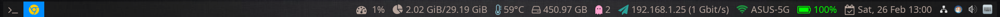
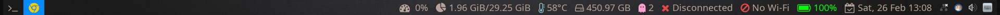
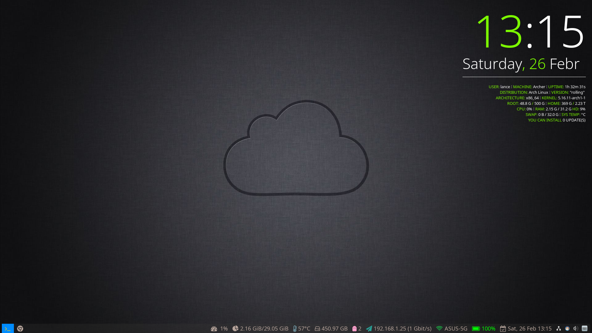

## Polybar Configuration

自用 polybar 配置，所使用的发行版为 Archlinux，桌面为 i3wm。我这边把 polybar config 文件放在 `~/.config/i3/polybar/` 下，请根据自己的实际情况来设置。

### Required:

#### Fonts:

- Font Awesome 4
- Font Awesome 5
- Material Design Icons Desktop

Font Awesome 4，5 可以通过 aur 安装。

```shell
yay -S ttf-font-awesome-4 ttf-font-awesome-5
```

另外一个字体将其复制到 `/usr/share/fonts/` 下


最后刷新一下字体缓存

```shell
sudo fc-cache -vf
```


### Display:

效果图如下：







